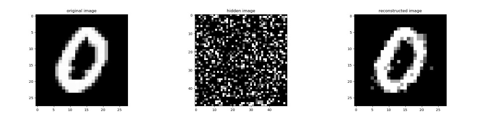
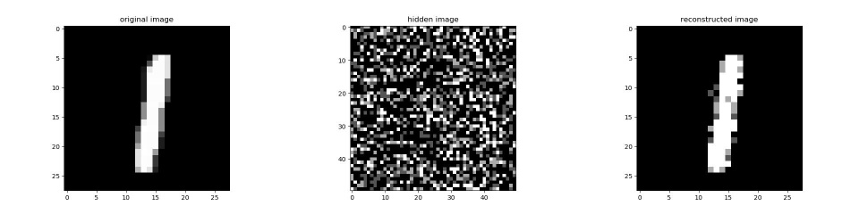
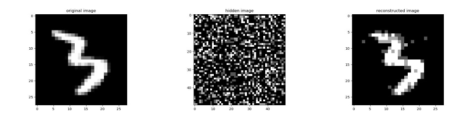
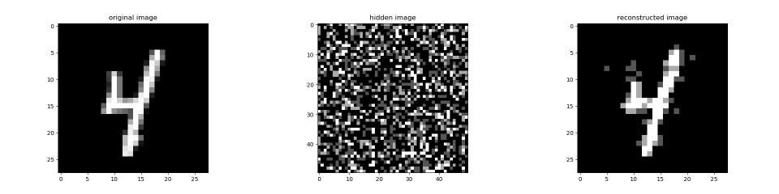
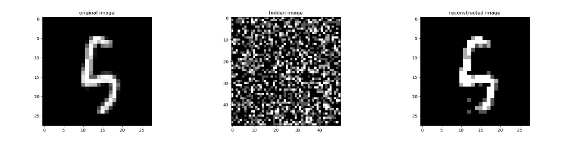
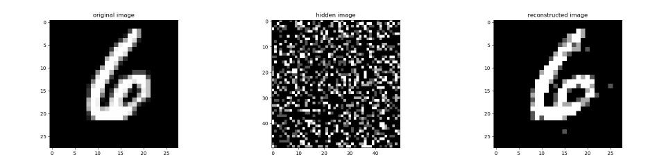
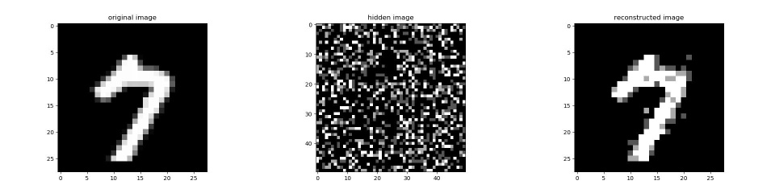
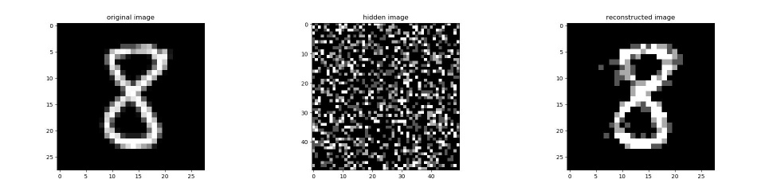
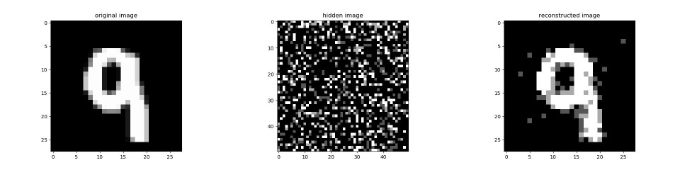

# Deep-Belief-Networks-in-PyTorch
The aim of this repository is to create RBMs, EBMs and DBNs in generalized manner, so as to allow modification and variation in model types.

## RBM:

Energy-Based Models are a set of deep learning models which utilize physics concept of energy. They determine dependencies between variables by associating a scalar value, which represents the energy to the complete system.

* It is a probabilistic, unsupervised, generative deep machine learning algorithm.
* It belongs to the energy-based model
* RBM is undirected and has only two layers, Input layer, and hidden layer
* No intralayer connection exists between the visible nodes. 
* All visible nodes are connected to all the hidden nodes

In an RBM, we have a symmetric bipartite graph where no two units within the same group are connected. Multiple RBMs can also be stacked and can be fine-tuned through the process of gradient descent and back-propagation. Such a network is called a Deep Belief Network.

The above project allows one to train an RBM and a DBN in PyTorch on both CPU and GPU. Finally let us take a look at some of the reconstructed images.

### Results - Restricted Boltzmann Machine:

Without Pre-Training:

epochs | test loss | train loss | test acc | train acc
---|---|---|---|---
1.0 | 1.793358325958252 | 1.7901512384414673 | 0.6681372549019607 | 0.672005772005772
2.0 | 1.703145980834961 | 1.6950132846832275 | 0.7593837535014005 | 0.7689033189033189
3.0 | 1.614591121673584 | 1.60787832736969 | 0.8499299719887955 | 0.8563492063492063
4.0 | 1.548156976699829 | 1.539191484451294 | 0.9173669467787114 | 0.9269119769119769
5.0 | 1.5276743173599243 | 1.5182831287384033 | 0.9369047619047619 | 0.9461760461760462

With Pre-Training:

epochs | test loss | train loss | test acc | train acc
---|---|---|---|---
1.0 | 1.5359452962875366 | 1.5310659408569336 | 0.9349439775910364 | 0.9391053391053391
2.0 | 1.514952540397644 | 1.5070991516113281 | 0.9525210084033613 | 0.9602813852813853
3.0 | 1.5090779066085815 | 1.4990419149398804 | 0.9563025210084034 | 0.9665584415584415
4.0 | 1.5039907693862915 | 1.4926044940948486 | 0.9602941176470589 | 0.9722943722943723
5.0 | 1.4975998401641846 | 1.4844372272491455 | 0.9669467787114846 | 0.9796536796536797

### Images - Restricted Boltzmann Machine:

## DBN - Deep Belief Networks:

Without Pre-Training:

epochs | test loss | train loss | test acc | train acc
---|---|---|---|---
1.0 | 2.0922505855560303 | 2.0851898193359375 | 0.3663865546218487 | 0.3729076479076479
2.0 | 1.9750773906707764 | 1.9623280763626099 | 0.47170868347338935 | 0.48412698412698413
3.0 | 1.9685752391815186 | 1.9543490409851074 | 0.47542016806722687 | 0.488997113997114
4.0 | 1.8826508522033691 | 1.8685916662216187 | 0.5653361344537815 | 0.5795093795093795
5.0 | 1.8766759634017944 | 1.8608087301254272 | 0.5695378151260504 | 0.58502886002886

With Pre-Training:

epochs | test loss | train loss | test acc | train acc
---|---|---|---|---
1.0 | 1.770219087600708 | 1.7662131786346436 | 0.7322829131652661 | 0.7357864357864358
2.0 | 1.5689512491226196 | 1.5623393058776855 | 0.9083333333333333 | 0.9134559884559884
3.0 | 1.5350960493087769 | 1.527496337890625 | 0.9321428571428572 | 0.9409090909090909
4.0 | 1.525390386581421 | 1.5150939226150513 | 0.9396358543417367 | 0.9506132756132756
5.0 | 1.5176178216934204 | 1.5056651830673218 | 0.9466386554621848 | 0.9582972582972583
