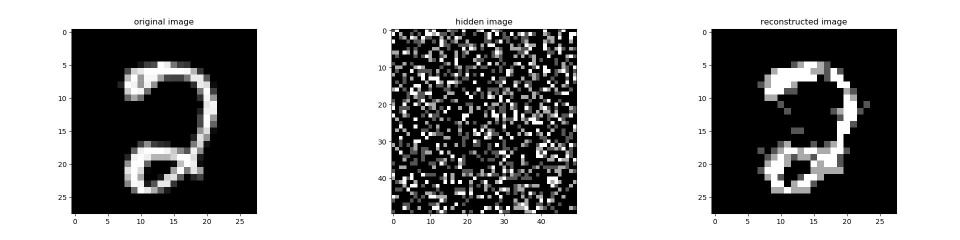

# Deep-Belief-Networks-in-PyTorch
The aim of this repository is to create RBMs, EBMs and DBNs in generalized manner, so as to allow modification and variation in model types.

## RBM:

Energy-Based Models are a set of deep learning models which utilize physics concept of energy. They determine dependencies between variables by associating a scalar value, which represents the energy to the complete system.

* It is a probabilistic, unsupervised, generative deep machine learning algorithm.
* It belongs to the energy-based model
* RBM is undirected and has only two layers, Input layer, and hidden layer
* No intralayer connection exists between the visible nodes. 
* All visible nodes are connected to all the hidden nodes

In an RBM, we have a symmetric bipartite graph where no two units within the same group are connected. Multiple RBMs can also be stacked and can be fine-tuned through the process of gradient descent and back-propagation. Such a network is called a Deep Belief Network.

The above project allows one to train an RBM and a DBN in PyTorch on both CPU and GPU. Finally let us take a look at some of the reconstructed images.

### Results - Restricted Boltzmann Machine:

Without Pre-Training:

epochs | test loss | train loss | test acc | train acc
---|---|---|---|---
1.0 | 1.793358325958252 | 1.7901512384414673 | 0.6681372549019607 | 0.672005772005772
2.0 | 1.703145980834961 | 1.6950132846832275 | 0.7593837535014005 | 0.7689033189033189
3.0 | 1.614591121673584 | 1.60787832736969 | 0.8499299719887955 | 0.8563492063492063
4.0 | 1.548156976699829 | 1.539191484451294 | 0.9173669467787114 | 0.9269119769119769
5.0 | 1.5276743173599243 | 1.5182831287384033 | 0.9369047619047619 | 0.9461760461760462

With Pre-Training:

epochs | test loss | train loss | test acc | train acc
---|---|---|---|---
1.0 | 1.5359452962875366 | 1.5310659408569336 | 0.9349439775910364 | 0.9391053391053391
2.0 | 1.514952540397644 | 1.5070991516113281 | 0.9525210084033613 | 0.9602813852813853
3.0 | 1.5090779066085815 | 1.4990419149398804 | 0.9563025210084034 | 0.9665584415584415
4.0 | 1.5039907693862915 | 1.4926044940948486 | 0.9602941176470589 | 0.9722943722943723
5.0 | 1.4975998401641846 | 1.4844372272491455 | 0.9669467787114846 | 0.9796536796536797

## DBN - Deep Belief Networks:

### Results - Deep Belief Networks:

Without Pre-Training:

epochs | test loss | train loss | test acc | train acc
---|---|---|---|---
1.0 | 1.7656803131103516 | 1.7620763778686523 | 0.7411764705882353 | 0.745021645021645
2.0 | 1.647426724433899 | 1.6424834728240967 | 0.8315826330532213 | 0.837049062049062
3.0 | 1.6079597473144531 | 1.6017967462539673 | 0.8528011204481792 | 0.8601731601731601
4.0 | 1.541589617729187 | 1.533886194229126 | 0.9266806722689076 | 0.9341269841269841
5.0 | 1.52533757686615 | 1.5153533220291138 | 0.9397759103641457 | 0.9494949494949495

With Pre-Training:

epochs | test loss | train loss | test acc | train acc
---|---|---|---|---
1.0 | 1.5659916400909424 | 1.563258409500122 | 0.9289915966386555 | 0.9310966810966811
2.0 | 1.5216224193572998 | 1.5138438940048218 | 0.9504901960784313 | 0.9579004329004329
3.0 | 1.5103492736816406 | 1.4991555213928223 | 0.9566526610644258 | 0.9685425685425686
4.0 | 1.5037704706192017 | 1.489931583404541 | 0.9618347338935574 | 0.9756132756132756
5.0 | 1.4998645782470703 | 1.4846107959747314 | 0.9647759103641457 | 0.9790764790764791

With Pre-Training and Input Binarization:

epochs | test loss | train loss | test acc | train acc
---|---|---|---|---
1.0 | 1.5000890493392944 | 1.4835282564163208 | 0.9633053221288516 | 0.9796176046176046
2.0 | 1.4980448484420776 | 1.4808478355407715 | 0.9640056022408964 | 0.9820707070707071
3.0 | 1.4971030950546265 | 1.4782592058181763 | 0.965546218487395 | 0.9841269841269841
4.0 | 1.4955949783325195 | 1.4761505126953125 | 0.9670868347338936 | 0.986002886002886
5.0 | 1.4929810762405396 | 1.474048376083374 | 0.9694677871148459 | 0.9876623376623377

## Images - Restricted Boltzmann Machine:

